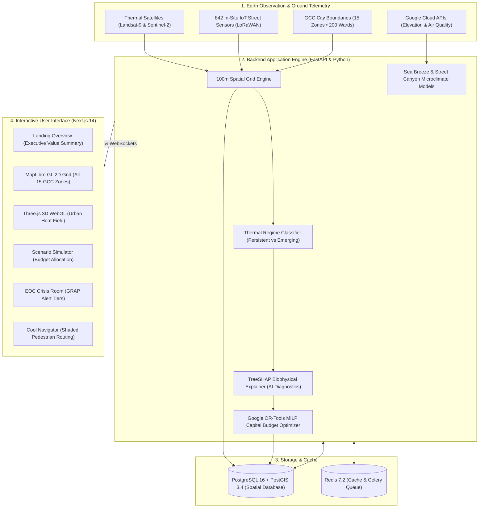
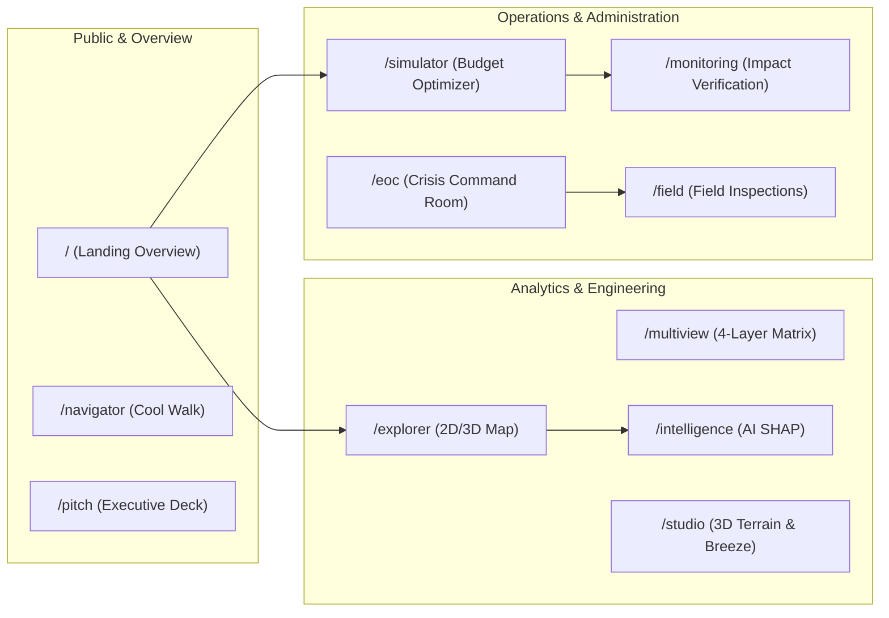
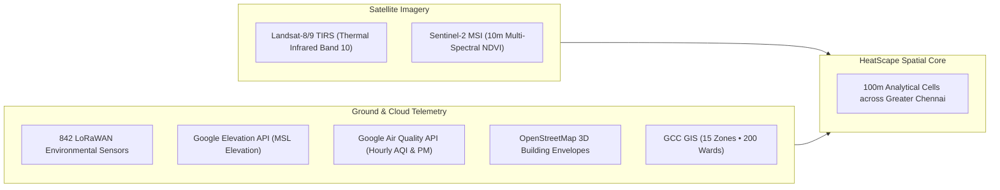
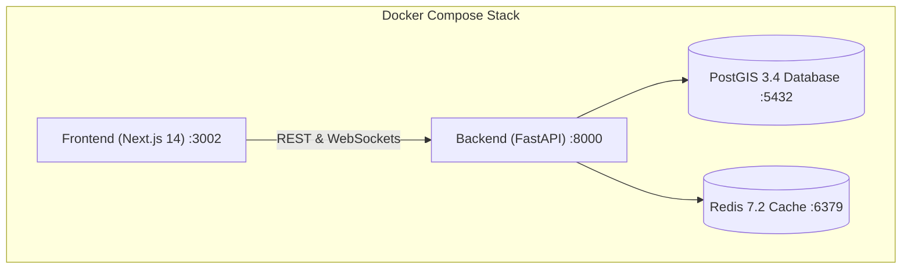

# HeatScape: Greater Chennai Corporation Urban Heat Platform

[](https://chennaicorporation.gov.in/)
[](https://fastapi.tiangolo.com)
[-black?style=flat-square&logo=next.js&logoColor=white)](https://nextjs.org/)
[-336791?style=flat-square&logo=postgresql&logoColor=white)](https://postgis.net/)
[](https://cloud.google.com/)
[](https://opensource.org/licenses/MIT)

**HeatScape** is an urban climate intelligence and intervention planning platform engineered for the **Greater Chennai Corporation (GCC)**. 

It takes thermal satellite imagery, live Google Cloud APIs, and real-time street sensor data, and turns them into clear, street-level cooling actions. Instead of overwhelming city administrators with raw GIS files, HeatScape detects which 100-meter blocks are dangerously hot, explains *why* they are hot (lack of trees, excessive asphalt, or trapped air), and mathematically calculates the most cost-effective cooling interventions to deploy within municipal budgets.

---

## 🏗️ System Architecture



---

## 🔄 How It Works: From Satellite Pixels to Civic Tenders

HeatScape follows a 5-step operational pipeline that bridges satellite observation directly to municipal public works:

```mermaid
sequenceDiagram
    autonumber
    participant Sat as Satellites & Sensors
    participant Grid as 100m Grid Engine
    participant AI as AI Root-Cause Explainer
    participant Opt as Budget Optimizer (MILP)
    participant Admin as City Engineers & Public Works

    Sat->>Grid: Ingest surface temperatures, tree canopy, & air quality
    Note over Grid: City is divided into uniform 100m blocks across all 15 zones
    Grid->>Grid: Compare current temperature to 36-month baseline
    Grid->>AI: Identify hotspots heating up faster than average
    AI->>AI: Decompose root cause (e.g., 42% green deficit, 31% asphalt)
    AI->>Opt: Pass flagged blocks with population & vulnerability data
    Admin->>Opt: Input available municipal budget (e.g., ₹50 Lakhs)
    Opt->>Opt: Match interventions against Tamil Nadu PWD 2024 Schedule of Rates
    Opt->>Admin: Export Council Briefing Resolution & Contractor Tendering GeoJSON
```

### 1. The 100-Meter Spatiotemporal City Grid
* Chennai is split into continuous **100m × 100m blocks** (each is 1 hectare) covering all **15 Zones** (from Thiruvottiyur and Manali in the north, to T. Nagar and Anna Nagar in the center, down to Adyar and Sholinganallur in the south).
* Every single block tracks:
  * **Surface temperature anomaly**: How much hotter it is compared to the city's seasonal baseline.
  * **Tree canopy fraction**: Percentage of natural shade coverage.
  * **Built impervious surface**: Percentage of heat-absorbing asphalt and concrete.
  * **Population density**: How many residents are living or working within that block.

### 2. Multi-Year Trend Detection (Not Just a Single Hot Day)
Instead of looking at isolated spikes, HeatScape analyzes 36 months of history for each cell and sorts it into one of 5 clear operational categories:
* **Persistent**: Consistently hot year after year (e.g., dense commercial corridors).
* **Emerging**: Rapidly heating up year-over-year due to new construction or loss of vegetation.
* **Improving**: Actively cooling down as a result of recent greening or park restorations.
* **Temporary**: Brief, short-lived spikes caused by seasonal weather swings.
* **Watch**: Stable areas with minor, non-critical fluctuations.

### 3. Clear Root-Cause Explanations (No Black Boxes)
City engineers don't need obscure AI scores—they need to know *what to fix*. HeatScape's TreeSHAP explainability engine breaks down the exact physical reasons why a block is overheating:
* **Vegetation Deficit**: Lack of tree canopy and soil moisture.
* **Impervious Concrete/Asphalt**: Sealed roads and terraces absorbing solar radiation during the day and re-radiating heat at night.
* **Street Canyon Trapping**: Tall, narrow building layouts that block incoming cooling wind.

### 4. Mathematical Budget Optimization (MILP Solver)
Municipal budgets are strictly limited. HeatScape uses Mixed-Integer Linear Programming to answer one fundamental question:
> *"Given a budget of ₹50 Lakhs in Ward 118, which specific interventions should we build, and where, to achieve the highest cooling impact for the most vulnerable citizens?"*

It matches candidate locations directly to the official **Tamil Nadu Public Works Department (PWD) 2024 Schedule of Rates**:
* **High-Albedo Cool Roof Coating** (SRI > 104): ₹150 / sq.meter (delivers $-0.8^\circ\text{C}$ to $-1.5^\circ\text{C}$ surface drop).
* **Dense Pocket Miyawaki Urban Forests** (native species): ₹3,000 / tree (delivers $-1.1^\circ\text{C}$ to $-2.0^\circ\text{C}$ cooling).
* **Permeable Interlocking Concrete Pavers**: ₹600 / sq.meter (reduces heat re-radiation and aids groundwater recharge).
* **Tensile Modular Shade Canopies**: ₹55,000 / transit stop (immediate $-3.0^\circ\text{C}$ radiant shade relief for commuters).

### 5. Emergency Crisis Management & Citizen Shading
* **Real-Feel Heat Index**: Combines ambient temperature with Chennai's coastal humidity ($60\%\text{--}80\%$). A $35^\circ\text{C}$ day with high humidity feels like $46^\circ\text{C}$ on the human body.
* **GCC Graded Response Action Plan (GRAP)**:
  * **Stage 1 (Watch)**: Activates 120+ *Thanneer Pandals* (drinking water kiosks) across transit corridors.
  * **Stage 2 (Severe)**: Mandates statutory outdoor work halts (12 PM – 3 PM) for construction and sanitation staff, and dispatches evaporative misting truck fleets.
  * **Stage 3 (Extreme)**: Converts GCC community halls into 24/7 air-conditioned cooling shelters.
* **Citizen Cool Navigator**: Functions like pedestrian navigation, but instead of finding the fastest route, it calculates the **most shaded path**, guiding walkers through tree-lined streets and shaded corridors.

---

## 📱 Application Screens & What They Do



| Screen | URL | What You Can Do Here |
| :--- | :--- | :--- |
| **Command Overview** | `/` | Executive landing page explaining HeatScape's mission, impact metrics, and quick ward search. |
| **Trajectories Map** | `/explorer` | Full MapLibre GL map with 100m grid cells across all 15 GCC zones, layer toggles, and 2020–2030 climate timelines. |
| **Multi-View Matrix** | `/multiview` | 4-layer comparison matrix (`Surface Temp`, `Tree Canopy`, `Built Roads`, `Vulnerability`) and tender corridor exports. |
| **Scenario Simulator** | `/simulator` | Interactive budget slider and MILP optimizer that outputs Council Briefing Memorandums and cost breakdowns. |
| **Impact Monitoring** | `/monitoring` | Difference-in-Differences (DiD) verification showing before-and-after cooling results of completed civil projects. |
| **Urban Intelligence** | `/intelligence` | TreeSHAP AI explainability rankings and demographic vulnerability hotspot maps. |
| **EOC Crisis Room** | `/eoc` | Emergency Operations Center tracking GRAP alert levels, mandatory work halts, and misting truck routes. |
| **Cool Navigator** | `/navigator` | Pedestrian shaded route planner that routes citizens along tree canopies and past public water kiosks. |
| **Terrain & Sea Breeze** | `/studio` | 3D elevation profiling and Bay of Bengal marine sea breeze intrusion graphs. |
| **Field Ops & Kanban** | `/field` | Mobile field checklist, Tamil voice note transcription, and photo verification for municipal ground staff. |
| **Executive Pitch Deck** | `/pitch` | 7-slide interactive pitch deck with built-in live calculators and scenario sandboxes. |

---

## 🌐 Data Sources Used

HeatScape operates on an integrated data stack combining satellite data, ground sensors, and live cloud APIs:



* **Thermal Infrared (LST)**: Landsat-8/9 TIRS & ECOSTRESS surface temperatures (re-sampled to 100m precision).
* **Vegetation Health (NDVI)**: Sentinel-2 MSI 10m bands 4 (Red) and 8 (Near-Infrared) measuring tree canopy density.
* **Topography & Elevation**: Google Elevation API and SRTM models measuring ground height above sea level.
* **Live Microclimate & Air Quality**: Google Air Quality API providing real-time Universal AQI, PM2.5, and PM10 values.
* **Ground-Truth Sensors**: 842 LoRaWAN IoT environmental sensor nodes deployed across commercial and transit hubs in Chennai.
* **Official Municipal Boundaries**: Greater Chennai Corporation 15 administrative zones and 200 electoral wards.

---

## 🚀 Running the Platform Locally

The entire system is containerized with Docker and requires zero manual database setup.



### Quickstart

```bash
# 1. Clone the repository
git clone https://github.com/jeeva-m-21/HeatScape-GCC.git
cd HeatScape-GCC

# 2. Start all microservices
docker compose up -d

# 3. Check that all containers are healthy
docker compose ps
```

### Accessing the Services
* **Frontend Web App**: [http://localhost:3002](http://localhost:3002)
* **Backend Interactive Swagger Docs**: [http://localhost:8000/docs](http://localhost:8000/docs)
* **PostGIS Database**: `localhost:5432` (`postgres:postgres@localhost:5432/heatscape`)
* **Redis Cache**: `localhost:6379`

### Running the Tests
```bash
# Run all 91 backend unit & integration tests (100% passing)
docker exec heatscape_backend pytest tests/ -v

# Run Next.js production build verification
docker exec heatscape_frontend npm run build
```

---

## 📡 API Reference Overview

The FastAPI backend exposes clean, documented REST endpoints:

* **`/api/v1/heat/cells/geojson`**: Streams 100m grid cell polygons with thermal anomalies, tree canopy, and built density.
* **`/api/v1/heat/cells/{cell_id}/history`**: Retrieves 36-month time-series history for any cell.
* **`/api/v1/heat/cells/{cell_id}/explain`**: Returns TreeSHAP biophysical root-cause attribution (vegetation vs. asphalt vs. buildings).
* **`/api/v1/google/elevation`**: Returns live topographical elevation from the Google Elevation API.
* **`/api/v1/google/air-quality`**: Returns live ambient air quality, PM2.5, and PM10 from the Google Air Quality API.
* **`/api/v1/scenarios/optimize`**: Runs the MILP optimization solver for a user-specified budget and target wards.
* **`/api/v1/scenarios/catalog`**: Catalogs cooling interventions mapped to the Tamil Nadu PWD 2024 Schedule of Rates.
* **`/api/v1/hazard/heatwave-forecast`**: Returns 7-day IMD heatwave alert tiers (Green, Yellow, Orange, Red).
* **`/api/v1/hazard/grap-status`**: Returns active GCC GRAP enforcement status (misting trucks, work halts).
* **`/api/v1/routing/cool-path`**: Calculates shaded pedestrian routes avoiding high-heat streets.

---

## 🏛️ Civic & Sovereign Standards

* **Bilingual Support**: Fully localized in both **English** and **Tamil (தமிழ்)** in compliance with Tamil Nadu Government administrative standards.
* **Open GIS Standards**: Native support for GeoJSON, STAC (SpatioTemporal Asset Catalog), and OGC API Features.
* **Actionable for GCC**: Directly outputs printable Council Briefing Memorandums and contractor-ready tender GeoJSON files for the Tamil Nadu Climate Change Mission.
