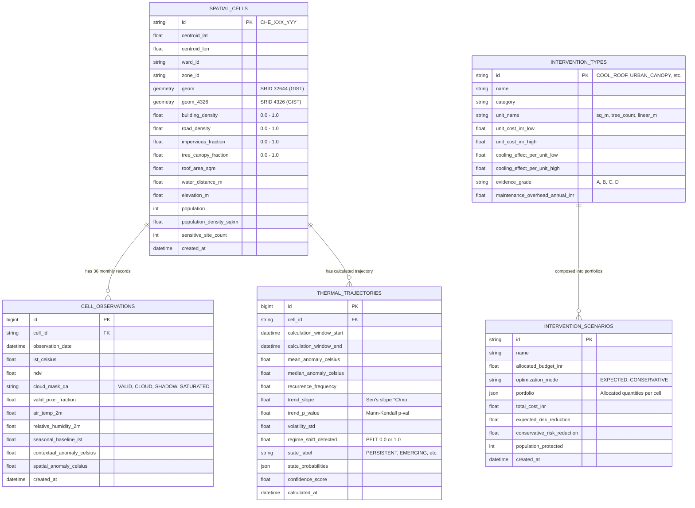

# HeatScape: System Architecture & Design Specification

## 1. Executive Summary

**HeatScape** is an enterprise-grade spatiotemporal urban heat intelligence and intervention planning platform designed for the **Greater Chennai Corporation (GCC)**, Tamil Nadu, India. Unlike conventional heat maps that merely present static satellite surface temperatures, HeatScape delivers a closed-loop diagnostic and prescriptive decision-support engine.

### Core Capabilities
1. **Dynamic Trajectory Classification**: Distinguishes structural chronic heating from transient weather anomalies via non-parametric statistics and change-point detection.
2. **Contextual & Neighborhood Normalization**: Calibrates observed Land Surface Temperatures (LST) against local seasonal baselines and Queen-contiguous spatial neighborhoods.
3. **Multi-Scale Attribution**:
   - **"Why Hot?"**: TreeSHAP feature attribution decomposing surface temperature into built-environment drivers (impervious fraction, building density, canopy deficit, elevation).
   - **"Why Now?"**: Temporal feature drift attribution isolating sudden land-use changes, vegetation loss, or microclimate regime shifts.
4. **Vulnerability Prioritization**: Cross-references thermal anomalies with high-density population registers and sensitive social infrastructure (schools, hospitals, transit terminals).
5. **Prescriptive Mixed-Integer Linear Programming (MILP)**: Employs Google OR-Tools to solve budget-constrained multi-intervention cooling portfolios under conservative and expected uncertainty regimes.

---

## 2. Spatial Foundations & Coordinate Reference Systems

```
+-----------------------------------------------------------------------------+
|                      GCC Study Extent: 426 km²                             |
|  Bounding Box (WGS84 EPSG:4326):                                            |
|    - Min Lon: 80.1150° E, Min Lat: 12.9150° N                               |
|    - Max Lon: 80.3350° E, Max Lat: 13.2450° N                               |
+-----------------------------------------------------------------------------+
                                       │
            Projected into EPSG:32644 (UTM Zone 44N)
                                       │
                                       ▼
+-----------------------------------------------------------------------------+
|            Analytical Spatial Unit: 100m × 100m Uniform Grid Cells          |
|                  Area = 10,000 m² (1.0 Hectare) per cell                     |
|           Total GCC Administrative Coverage: ~42,600 units                  |
|           Prototype / Seed Spatial Coverage: 1,200 units                    |
+-----------------------------------------------------------------------------+
```

### 2.1 CRS Separation of Concerns
- **Analytical & Distance CRS (`EPSG:32644` - UTM Zone 44N)**:
  - Metric Cartesian coordinate system centered over Tamil Nadu.
  - Used for all geometric calculations: cell polygon construction (100m x 100m), Queen contiguity neighbor detection, spatial distance buffers to water bodies (`water_distance_m`), building footprint ratios, and tree canopy coverage.
  - Stored in PostGIS column `spatial_cells.geom`.
- **Interchange & Rendering CRS (`EPSG:4326` - WGS84)**:
  - Latitude / Longitude coordinates in degrees.
  - Exclusively used for RFC 7946 GeoJSON client payloads, MapLibre GL JS vector rendering, and Leaflet compatibility.
  - Stored in PostGIS column `spatial_cells.geom_4326` (pre-computed and GIST indexed) to eliminate runtime coordinate projection overhead during high-throughput tile/GeoJSON queries.

---

## 3. High-Level System Architecture

```
  +------------------------------------------------------------------------+
  |                   Client Tier: Next.js 14 (App Router)                 |
  |   - Dark Mode UI (Tailwind CSS, Inter + IBM Plex Mono)                |
  |   - MapLibre GL JS (WebGL Grid Polygons, Dynamic Heat Classification)   |
  |   - Diagnostic Drawer ("Why Hot?" SHAP, "Why Now?" Drift, Sparklines)  |
  |   - Intervention Simulator (OR-Tools Portfolio Optimizer UI)           |
  +-----------------------------------+------------------------------------+
                                      │  HTTPS / REST / GeoJSON
                                      ▼
  +------------------------------------------------------------------------+
  |                     API Gateway: FastAPI (Python 3.11+)                 |
  |   - /api/v1/heat/cells/geojson  (Direct PostGIS ST_AsGeoJSON stream)   |
  |   - /api/v1/heat/cells/{id}/history (36-month time-series)             |
  |   - /api/v1/heat/cells/{id}/explain (TreeSHAP & Drift Attribution)     |
  |   - /api/v1/heat/kpi (Aggregated vulnerability metrics)                |
  |   - /api/v1/optimize (MILP Portfolio solver execution)                 |
  |   - /api/v1/pipelines/seed & recalculate                               |
  +-----------------+---------------------------------+--------------------+
                    │                                 │
                    ▼                                 ▼
  +----------------------------------+  +----------------------------------+
  |     Analytical Services Tier     |  |      Asynchronous Processing     |
  | - GridService (EPSG:32644 mesh)  |  | - Celery Worker + Redis Broker   |
  | - TrajectoryService (PELT, Sen,  |  | - Long-running Batch Recomputes  |
  |   Mann-Kendall, Softmax State)   |  | - Tile Cache Invalidation        |
  | - OptimizerService (OR-Tools     |  | - Scenario Simulation Cache      |
  |   MILP Knapsack / SCIP Solver)   |  +----------------------------------+
  | - ExplainerService (TreeSHAP)    |
  | - SyntheticSeedService (1.2k seed|
  +-----------------+----------------+
                    │
                    ▼
  +------------------------------------------------------------------------+
  |                 Storage Tier: PostgreSQL 16 + PostGIS 3.4              |
  |   - spatial_cells (Polygons in 32644 & 4326, Spatial GIST Indices)     |
  |   - cell_observations (36-month panel LST, NDVI, Anomalies)            |
  |   - thermal_trajectories (Sen's slope, PELT change points, states)     |
  |   - intervention_types & intervention_scenarios                        |
  +------------------------------------------------------------------------+
```

---

## 4. Database Schema Relationships



---

## 5. Security, Resilience & Scalability Measures

1. **SQL Injection Prevention**: All spatial and relational queries leverage SQLAlchemy 2.0 ORM and parameterized PostGIS functions (`geoalchemy2`). No string formatting for raw geometry strings.
2. **Deterministic Seed Generator**: Embedded high-fidelity generator creates 1,200 grid cells across Central, North, and South Chennai with complete 36-month observational histories, enabling zero-external-dependency local development and automated CI.
3. **GeoJSON Streaming Performance**: Direct serialization of EPSG:4326 geometries via PostGIS `ST_AsGeoJSON` returns a unified GeoJSON `FeatureCollection` directly from the database engine in a single round-trip.
4. **Idempotent Migration Pipeline**: Alembic handles initial table creation and spatial extension registration (`CREATE EXTENSION IF NOT EXISTS postgis;`).
